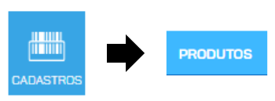

---
layout:
  title:
    visible: true
  description:
    visible: true
  tableOfContents:
    visible: true
  outline:
    visible: true
  pagination:
    visible: true
---

# Nota Fiscal de Produtos (NF-e)

### INTRODUÇÃO


Esse guia tem por objetivo orientar os usuários na utilização do Emissor de NF-e SEBRAE


#### ACESSANDO O EMISSOR SEBRAE

O acesso ao sistema será realizado via navegador web e está disponível no portal do SEBRAE.
\
Para ingressar nos sistema acesse [https://emissornfe.sebrae.com.br](https://emissornfe.sebrae.com.br)
\
Se você já possui cadastro, basta informar seus dados de login e senha e clicar em **ENTRAR**.

<figure><figcaption></figcaption></figure>

#### CADASTRE-SE NO EMISSOR SEBRAE

Se for seu primeiro acesso e você precisa se cadastrar, clique em **CADASTRE-SE**.

<figure><figcaption></figcaption></figure>

Preencha todos os dados do formulário e ao clicar em **CONTINUAR**, você irá confirmar se está de
\
acordo com a política de privacidade e responder à pergunta, com isso seu usuário será
\
cadastrado com sucesso.

<figure><figcaption></figcaption></figure>

Antes de finalizar o cadastro, responda se aceita ou não receber informações do Sebrae sobre
\
campanhas, dicas e ofertas. O cadastro será aceito somente quando for dado aceite nos termos
\
da Política de Privacidade. O documento está disponível para leitura no próprio link da Política de
\
Privacidade. Após clicar em **CADASTRAR**, seu cadastro como Pessoa Física estará realizado.

<figure><figcaption></figcaption></figure>

#### RECUPERE SUA SENHA DE ACESSO

Uma vez cadastrado, você poderá efetuar o seu login.
\
Caso não se lembre da senha, nessa mesma tela, há a opção para recuperação de senha. Para
\
isso,
\
Clique em **ESQUECEU SUA SENHA**.

<figure><figcaption></figcaption></figure>

Na tela para recuperação de senha, deverá ser digitado o CPF ou e-mail associado à conta,
\
clicando em **ENVIAR**. As instruções para criação de uma nova senha, serão enviadas via e-mail ou
\
telefone cadastrado.

<figure><figcaption></figcaption></figure>

O cadastro e o login efetuados até aqui dizem respeito à pessoa física que está operando o
\
sistema. Para ter acesso ao Emissor de NF-e SEBRAE, você deverá estar vinculado a uma ou mais
\
empresas.

#### CADASTRO DE EMITENTE

Após confirmar o cadastramento da pessoa física, caso o seu CPF ainda não esteja associado a
\
pelo menos uma empresa, você será direcionado ao **CADASTRO DE EMITENTE**. Preencha os
\
dados e clique em **CRIAR CONTA**

<figure><figcaption></figcaption></figure>

É possível adicionar o tipo do seu certificado no campo "POSSUI CERTIFICADO DIGITAL?"

Selecionando o USAR CERTIFICADO DIGITAL A1, um pop-up dos seus arquivos irá subir para que
\
possa incluir um certificado do modelo A1 (arquivo digital em formato .pfx).

<figure><figcaption></figcaption></figure>

Selecionando o USAR CERTIFICADO DIGITAL A3, um pop-up do ASSINADOR DIGITAL irá subir para
\
que possa colocar a senha do seu certificado que estará conectado em sua máquina e em
\
execução para reconhecimento e emissão de suas futuras notas.

#### SELEÇÃO DE INSTALAÇÃO

É possível realizar o acesso simplificado a múltiplas contas vinculadas, ao colocar seu CPF e
\
SENHA dentro do AMEI.SEBRAE.COM.BR:

<figure><figcaption></figcaption></figure>

Ao logar, será redirecionado para a seguinte página:

<figure><figcaption></figcaption></figure>

Nela conseguirá selecionar suas empresas vinculadas sendo redirecionadas para elas ou criar
\
novas empresas.

#### PRIMEIRO ACESSO

Ao acessar o Emissor Sebrae, o usuário verá uma home onde será possível identificar alertas
\
sobre suas Notas Fiscais, e também sobre o status de seu Certificado Digital.
\
É a partir dessa tela que a navegação na plataforma será possível.

<figure><figcaption></figcaption></figure>

Vamos ver a seguir todos os pontos que contemplam o **Emissor Sebrae**.

### CONFIGURAÇÕES DA EMPRESA

#### TECLAS DE ATALHO

Para facilitar o uso do Emissor Sebrae, disponibilizamos teclas de atalho no teclado. Para exibir os
\
atalhos, clique F1 em qualquer página do Emissor.

<figure><figcaption></figcaption></figure>

#### DADOS GERAIS

Para configurar os **DADOS GERAIS** da sua empresa, como **CNPJ**, razão social e endereços, acesse
\
o menu **AJUSTES > CONFIGURAÇÕES DA EMPRESA**.

<figure><figcaption></figcaption></figure>

No campo **INFORMAÇÕES DA EMPRESA**, preencha a **RAZÃO SOCIAL**, **NOME FANTASIA**, escolha
\
o segmento na **ÁREA DE ATUAÇÃO** (essa informação não influencia na emissão de documentos
\
fiscais) e preencha o **CNPJ**. Para realizar a emissão dos documentos fiscais (NF-E, NFC-E e CT-E),
\
informe sua **INSCRIÇÃO ESTADUAL**. Se você pretende emitir somente NFS-e (notas de serviço),
\
informe a **INSCRIÇÃO MUNICIPAL**.
\
Informe o e-mail e telefones de contato. Também poderá **inserir o logo** da empresa para
\
personalizar suas notas fiscais.

<figure><figcaption></figcaption></figure>

#### PRODUTOR RURAL

Se você é um **PRODUTOR RURAL** com CPF, marque a opção indicada e no lugar do CNPJ, informe
\
o **CPF** atrelado a Inscrição Estadual. Com essa opção, será possível emitir documentos fiscais
\
associados a um **certificado** A1 ou A3 do tipo **e-CPF**.
\
Essa opção é exclusiva para os produtores rurais com CPF. Caso você seja produtor rural mas
\
possui um CNPJ, não há necessidade de marcar a opção.

<figure><figcaption></figcaption></figure>

No campo **FUSO HORÁRIO** selecione o fuso horário de sua cidade e se utiliza ou não Horário de
\
Verão. Essa informação é importante pois quando se emite documentos fiscais, existem prazos
\
obrigatórios.

<figure><figcaption></figcaption></figure>

Também é nessa tela que você irá informar os endereços da sua empresa.
\
O **ENDEREÇO DE FATURAMENTO** é o endereço que dita seu tipo de Nota Fiscal, base de cálculo
\
dos impostos, sua inscrição estadual e municipal.
\
O **ENDEREÇO DE ENTREGA** e o **ENDEREÇO DE CORRESPONDÊNCIA** são os endereços onde
\
você poderá receber suas entregas e correspondências.

<figure><figcaption></figcaption></figure>

Depois de preencher os dados, desça até o final da página e clique em **SALVAR**.

<figure><figcaption></figcaption></figure>

#### CONFIGURAÇÕES DE CNPJ EMISSORES

Caso você possua mais de uma empresa para administrar, você poderá criar acessos para os
\
diferentes CNPJs usando a tela de CNPJ Emissores.
\
Para poder associar um CNPJ ao seu cadastro, é necessário que ele esteja previamente
\
cadastrado em outro CPF.
\
Acesse **AJUSTES > CONFIGURAÇÃO DE CNPJ EMISSORES**

<figure><figcaption></figcaption></figure>

Clique em **CONVIDAR USUÁRIO** e informe o e-mail atrelado ao cadastro do **CNPJ**.

<figure><figcaption></figcaption></figure>

<figure><figcaption></figcaption></figure>

O convidado receberá um email para confirmar a permissão de acesso.
\
Assim que a permissão for concedida, será possível acessar as outras contas utilizando o atalho.

<figure><figcaption></figcaption></figure>

#### CADASTRO DE USUÁRIOS

Para que outras pessoas, como por exemplo, seu contador ou outros funcionários possam acessar
\
sua empresa no Emissor Sebrae, é necessário que primeiro elas realizem o [cadastro no sistema
\
AMEI](https://amei.sebrae.com.br/auth/realms/externo/login-actions/registration?client_id=emissor-nfe-frontend\&tab_id=k_gfxNEesGQ).
\
Depois do cadastro no AMEI realizado, acesse **AJUSTES > CADASTRO DE USUÁRIOS**

<figure><figcaption></figcaption></figure>

Então clique em **CONVIDAR NOVO USUÁRIO** e informe o e-mail cadastrado pelo usuário no AMEI.

<figure><figcaption></figcaption></figure>

<figure><figcaption></figcaption></figure>

O usuário convidado receberá um e-mail para confirmar a permissão de acesso ao seu cadastro

#### CONFIGURAÇÕES DE PERMISSÕES

Depois que o usuário convidado aceitar o acesso, você poderá definir quais informações da sua
\
conta serão acessíveis a ele, e para isso você deve configurar as permissões.
\
Ainda na tela de Usuário, escolha o **Perfil** em que aquele usuário se enquadra, e clique em
\
**SALVAR**

<figure><figcaption></figcaption></figure>

<figure><figcaption></figcaption></figure>

Depois acesse **AJUSTES > CONFIGURAR PERMISSÕES** e escolha o grupo de usuário que deseja
\
configurar as permissões. O Emissor já vem com algumas predefinições por padrão, mas você
\
poderá alterar e criar novas opções como desejar.

<figure><figcaption></figcaption></figure>

Em seguida, clique no módulo desejado do sistema. Você também poderá criar um novo grupo
\
para personalizar.

<figure><figcaption></figcaption></figure>

Você verá dois símbolos para utilizar:

✓ - Permitir a funcionalidade
\
× - Bloquear a funcionalidade

Para alterar, basta clicar em cima da funcionalidade que deseja permitir ou bloquear.

<figure><figcaption></figcaption></figure>

Não esqueça de clicar em **SALVAR** no final da página para gravar as alterações!

<figure><figcaption></figcaption></figure>

#### CONSULTA DE LOGS DE USO

As informações encontradas em **AJUSTES > CONSULTA DE LOGS DE USO** não são de fácil
\
entendimento, mas podem ser solicitadas e consultadas pelo time de suporte, a fim de identificar
\
atividades realizadas no emissor. Por isso, caso seja solicitado, compartilhe as informações com o
\
time de suporte.

<figure><figcaption></figcaption></figure>

<figure><figcaption></figcaption></figure>

### CADASTROS

No menu **CADASTROS** você encontra tudo o que precisa para manter a organização de seus
\
produtos, serviços, clientes, fornecedores, entre outros.

#### PRODUTOS

O cadastro de produtos é de extrema importância para que o empreendedor consiga gerir e
\
administrar o seu negócio de maneira eficaz. Através do cadastro de produtos, você será capaz de
\
emitir suas notas fiscais e controlar o estoque de produtos e insumos.
\
Para cadastrar um produto no **Emissor Sebrae**, siga o passo a passo:
\
Acesse o menu **CADASTROS > PRODUTOS**

<figure><figcaption></figcaption></figure>

Clique em **ADICIONAR NOVO**.

<figure><figcaption></figcaption></figure>

Se você comercializa produtos industrializados e tem os códigos de barras oficiais, escolha
\
**CADASTRO AUTOMÁTICO**, e informe o código de barras para que o sistema preencha
\
automaticamente as informações sobre o produto. Caso você não tenha o código de barras do
\
produto, opte pelo **CADASTRO MANUAL** e preencha as informações.
\
Preencha

<figure><figcaption></figcaption></figure>

Preencha os campos obrigatórios (em cinza escuro): **DESCRIÇÃO, TIPO DE ITEM, UNIDADE,** e
\
**PREÇO DE CUSTO** e **VENDA VAREJO**.

<figure><figcaption></figcaption></figure>

Habilite a movimentação do **ESTOQUE** para realizar as movimentações daquele produto.

<figure><figcaption></figcaption></figure>

Para incluir a quantidade inicial de itens, selecione **ENTRADA**, informe a **QUANTIDADE** e clique
\
em **OK**.

<figure><figcaption></figcaption></figure>

No campo **FISCAL**, o preenchimento é obrigatório para que você possa emitir suas Notas Fiscais.
\
Preencha os campos obrigatórios **TIPO**, **NCM** e **ORIGEM**. O Campo **CEST** só deve ser preenchido
\
em casos de substituição tributária.

<figure><figcaption></figcaption></figure>

Após preencher todos os dados, lembre-se de clicar em **SALVAR**.

<figure><figcaption></figcaption></figure>

#### MEDICAMENTOS

Se os produtos que estiverem sendo cadastrados forem **MEDICAMENTOS**, será necessário
\
informar **DADOS FISCAIS** adicionais. Em **TIPO**, selecione a opção MEDICAMENTOS e preencha os
\
campos obrigatórios **CÓDIGO ANVISA** e **PREÇO MÁXIMO AO CONSUMIDOR**.

<figure><figcaption></figcaption></figure>

Após preencher todos os dados, lembre-se de clicar em **SALVAR**.

<figure><figcaption></figcaption></figure>

#### ARMAMENTOS

Se os produtos que estiverem sendo cadastrados forem **ARMAMENTOS**, será necessário informar
\
**DADOS FISCAIS** adicionais. Em **TIPO**, selecione a opção ARMAMENTOS e preencha os campos
\
obrigatórios **DESCRIÇÃO DO ARMAMENTO** e **TIPO DE ARMAMENTO**.

<figure><figcaption></figcaption></figure>

Após preencher todos os dados, lembre-se de clicar em **SALVAR**.

<figure><figcaption></figcaption></figure>

#### COMBUSTÍVEIS E DERIVADOS DE PETRÓLEO

Os **COMBUSTÍVEIS** e produtos **DERIVADOS DE PETRÓLEO** tem uma legislação bem restrita e
\
específica especialmente para a emissão de documentos fiscais. Por isso possui características
\
únicas de cadastro que devem ser preenchidas de maneira correta para evitar problemas no
\
momento da emissão.
\
Na aba **FISCAL**, ao escolher o **TIPO** de produto como **COMBUSTÍVEL**, você verá que novos
\
campos surgirão.

<figure><figcaption></figcaption></figure>

Os campos destacados em cinza escuro são de preenchimento obrigatório. Lembre-se de
\
consultar seu contador ou um especialista em emissão de combustíveis para informar os códigos
\
corretos.

Um mesmo combustível poderá ter mais de um **Indicador de Importação, UF de Origem** e
\
**Percentual Originário**. Para isso, preencha os campos e clique em **INCLUIR**, para assim adicionar
\
essa opção à lista.
\
**Atenção: Só será possível emitir NF-e para a venda de combustíveis e derivados. A emissão**
\
**de NFC-e ainda não está disponível para esses produtos específicos.**

#### COMÉRCIO DE VEÍCULOS

Se você deseja comercializar **VEÍCULOS**, será necessário cadastrar dados fiscais específicos.
\
Selecione a opção **VEÍCULOS NOVOS** na classificação, e preencha todos os campos destacados
\
em cinza escura. Esses são os campos obrigatórios. Lembre-se de consultar um especialista para
\
preencher os dados corretamente.

<figure><figcaption></figcaption></figure>

#### PRODUTOS COM COMPOSIÇÃO

Caso seu produto seja composto por outro(s) produto(s), você deverá listá-los na
\
aba **COMPOSIÇÃO**. Lembre-se que esses produtos precisam estar cadastrados previamente.
\
Selecione o produto e clique em **INCLUIR**. Repita até que todos os itens estejam listados. Não é
\
possível incluir serviços na composição de produtos.

<figure><figcaption></figcaption></figure>

Depois de listar os produtos, selecione novamente a aba **ESTOQUE** e marque a opção
\
**MOVIMENTA ESTOQUE DA COMPOSIÇÃO**, assim, ao vender um produto com composição, o
\
estoque dos insumos será movimentado.

<figure><figcaption></figcaption></figure>

Após preencher todos os dados, lembre-se de clicar em **SALVAR**.

<figure><figcaption></figcaption></figure>

#### PRODUTOS FRAGMENTADOS

Para produtos fragmentados, vá em **FRAGMENTAÇÃO** e preencha os campos obrigatórios.

<figure><figcaption></figcaption></figure>

Após preencher todos os dados, lembre-se de clicar em **SALVAR**.

<figure><figcaption></figcaption></figure>

#### PRODUTOS COM VARIAÇÃO (ESTOQUE GRADE)

Para os produtos que possuem variações mas são comercializados com o mesmo valor,
\
possuímos a opção de **ESTOQUE GRADE**. Para configurar essa opção, ao habilitar a
\
movimentação de estoque, escolha a opção **GRADE**

<figure><figcaption></figcaption></figure>

Um novo campo estará aberto para o preenchimento com **CORES** e **TAMANHOS**. Clique no botão **+** para adicionar um tamanho ou cor já presentes no sistema.

<figure><figcaption></figcaption></figure>

<figure><figcaption></figcaption></figure>

Caso queira adicionar outras opções de tamanho ou cor, clique no +.

<figure><figcaption></figcaption></figure>

Após descrever os tamanhos e cores para seu estoque de grade, insira a quantidade de cada
\
produto.
\
No campo **QUANTIDADE EM ESTOQUE**, na opção **ATUAL** você poderá informar a quantidade atual
\
dos produtos que há em estoque, e na opção **MÍNIMO**, informe a quantidade mínima do produto
\
para que você receba os alertas informativos do sistema.

<figure><figcaption></figcaption></figure> <figure><figcaption></figcaption></figure>

Após preencher todos os dados, lembre-se de clicar em **SALVAR**.

<figure><figcaption></figcaption></figure>

#### MOVIMENTAÇÃO DE ESTOQUE

Depois de informar a quantidade em estoque, para que as movimentações de estoque sejam
\
realizadas corretamente no momento das emissões fiscais, é necessário habilitá-la nas Naturezas
\
de Operação.
\
Acesse o menu **AJUSTES > NATUREZA DE OPERAÇÃO** e encontre a Natureza que deseja
\
habilitar a movimentação de estoque.

<figure><figcaption></figcaption></figure>

Na tela da natureza, marque a opção Movimenta Estoque para que fique ativa (quando está em
\
azul)

<figure><figcaption></figcaption></figure>

<figure><figcaption></figcaption></figure>

Para concluir, vá até o final na página e clique em **SALVAR**.

<figure><figcaption></figcaption></figure>

A movimentação de estoque seguirá o tipo de movimentação da Natureza de operação, se for uma
\
NatOp de **SAÍDA** (exemplo: venda, devolução para fornecedor), ocorrerá uma saída de estoque. Se
\
for uma NatOp de **ENTRADA** (exemplo: compra, devolução de cliente), ocorrerá uma entrada de
\
estoque. O estoque será atualizado no momento em que a nota fiscal for emitida.

#### IMPORTE UMA PLANILHA DE PRODUTOS

Quando há a necessidade de cadastrar vários produtos de uma vez, você pode utilizar o recurso
\
de **IMPORTAÇÃO DE PLANILHA**.
\
Para isso, acesse o menu Acesse o menu **CADASTROS > PRODUTOS**

<figure><figcaption></figcaption></figure>

Selecione a opção **IMPORTAR**.

<figure><figcaption></figcaption></figure>

Baixe o **ARQUIVO MODELO** e assim que o download for concluído, verifique no canto inferior da
\
tela, abra e comece a cadastrar seus dados.

<figure><figcaption></figcaption></figure>

<figure><figcaption></figcaption></figure>

Na planilha existem 24 colunas porém nem todas precisam ser preenchidas. Em nenhuma coluna
\
pode haver fórmulas, as colunas numéricas não podem ter espaço, os campos devem ser
\
preenchidos e não editados e nenhum preenchimento pode conter caracteres especiais (por
\
exemplo: ! @ # $ % & \* ( ) - = +)

Vamos ver a seguir cada coluna e especificar para que servem:

**INFORMAÇÕES DO PRODUTO** - Os campos destacados em <mark style="color:red;">VERMELHO</mark> são de preenchimento
&#x20;obrigatório

<figure><figcaption></figcaption></figure>

**CÓDIGO DE BARRAS** - (coluna numérica) Preencha com o código de barras do produto. Caso seu
\
produto não tenha código de barras, preencha com um código neutro (sugestão
\
2000000000000 e siga a sequência) - Cada produto deve ter um código de barras único e essa
\
coluna não deve ser alterada depois de importada para não causa duplicidade de produtos;
\
**TIPO DE PRODUTO** - (coluna de seleção) Já existem algumas opções. Não digite, apenas
\
selecione. Uma dica para reproduzir a mesma opção em várias linhas é clicar com o mouse no
\
encontro da linha e da coluna, e arrastar para baixo conforme a imagem a seguir.

<figure><figcaption></figcaption></figure>

**DESCRIÇÃO** - (coluna digitável) Preencha com o nome do Produto (limite de 400 caracteres
&#x20;incluindo espaço)
\
**PREÇO DE CUSTO** - (coluna numérica) Preencha com o valor de custo do Produto
\
**PREÇO VENDA VAREJO** - (coluna numérica) Preencha com o valor de venda do Produto
\
**PREÇO VENDA ATACADO** - (coluna numérica) Preencha o valor de venda no atacado do Produto
\
**QUANTIDADE MÍNIMA ATACADO** - (coluna numérica) - Preencha com a quantidade mínima para
&#x20;que o preço de atacado seja aplicado (mínimo 2)
\
**UNIDADE** (coluna de seleção) já existem algumas opções. Não digite, apenas selecione. Uma dica
\
para reproduzir a mesma opção em várias linhas é clicar com o mouse no encontro da linha e da
&#x20;coluna, e arrastar para baixo conforme mostrado anteriormente.
\
**ATIVO** - (coluna digitável) Escreva SIM caso esse produto esteja ativo para venda e NÃO caso
&#x20;esse produto não esta ativo para venda.

**CONTROLE DE ESTOQUE** - Nenhuma dessas colunas é de preenchimento obrigatório, porém
\
caso você queira habilitar o controle de estoque sugerimos que as preencha.

<figure><figcaption></figcaption></figure>

**CATEGORIA DO PRODUTO** - (coluna digitável) Preencha com a categoria de seu produto. EX.:
\
Roupa Infantil, roupa masculina, etc.
\
**SUBCATEGORIA DO PRODUTO** - (coluna digitável) Preencha com a subcategoria de seu produto.
\
EX.: Body, camisetas, calças, etc,
\
**MOVIMENTA ESTOQUE** - (coluna digitável) Escreva SIM caso deseje que esse produto movimente
&#x20;estoque automaticamente e NÃO caso não queira que esse produto movimente estoque
&#x20;automaticamente
\
**ESTOQUE MÍNIMO** - (coluna numérica) Preencha com a quantidade mínima de estoque. Ao atingir
&#x20;essa quantidade, o produto será listado como Item com estoque baixo nos alertas. Não deixe a
&#x20;coluna vazia. Caso não tenha estoque, coloque 0
\
**QUANTIDADE EM ESTOQUE**- (coluna numérica) Preencha com a quantidade atual do produto em
\
estoque. Não deixe a coluna vazia. Caso não tenha estoque, coloque 0
\
**MARCA** - (coluna digitável) Preencha com a marca do produto
\
**MODELO** - (coluna digitável) Preencha com o modelo do produto
\
**CÓDIGO BALANÇA** - (coluna numérica) Caso você faça vendas com a utilização de balança,
&#x20;preencha esse campo com o código de 4 dígitos com que o produto foi identificado na sua
&#x20;balança
\
**CÓDIGO INTERNO** - (coluna digitável) Preencha essa coluna com um código interno para facilitar
&#x20;a busca do produto no momento da venda.
\
**TAGS** - (coluna digitável) Utilize as tags para "agrupar" seus produtos. Elas podem facilitar na
&#x20;identificação dos produtos. Você pode atribuir mais de uma tag ao mesmo produto, sempre
&#x20;separando as palavras com ; e sem espaço (EX: shampoo; cabelos; beleza). Lembre-se de sempre
&#x20;utilizar as mesmas palavras para que os produtos sejam agrupados de forma correta.

**CONTROLE FISCAL** - Preencha essas colunas caso você emita documento fiscal, seguindo as
&#x20;orientações de seu contador. Nesse caso, as colunas TIPO, NCM e ORIGEM são de preenchimento
&#x20;obrigatório

<figure><figcaption></figcaption></figure>

**TIPO** - (coluna de seleção) Já existem algumas opções. Não digite, apenas selecione. Uma dica
&#x20;para reproduzir a mesma opção em várias linhas é clicar com o mouse no encontro da linha e da
&#x20;coluna, e arrastar para baixo conforme mostrado anteriormente.

<figure><figcaption></figcaption></figure>

**NCM** - (coluna digitável) Preencha com o NCM do produto. Consulte o seu contador
\
**CFOP** - (coluna numérica) Preencha SOMENTE se for emitir NFC-e e o produto seja uma exceção
\
do CFOP padrão escolhido. Consulte o seu contador.
\
**ORIGEM** - (coluna de seleção) Já existem algumas opções. Não digite, apenas selecione. Uma
&#x20;dica para reproduzir a mesma opção em várias linhas é clicar com o mouse no encontro da linha e
&#x20;da coluna, e arrastar para baixo conforme mostrado anteriormente.

<figure><figcaption></figcaption></figure>

**CEST**- (coluna numérica) Preencha SOMENTE se o produto tiver Substituição Tributária. Consulte
&#x20;o seu contador

Salve a planilha.

De volta ao Emissor, clique novamente no ícone **IMPORTAR**, e dessa vez clique na opção **ENVIAR
&#x20;ARQUIVO**. Localize o arquivo no computador e clique em **ABRIR.**

#### &#xD;

<figure><figcaption></figcaption></figure>

Uma mensagem de confirmação aparecerá com o resumo das alterações que serão feitas. Clique
&#x20;em **IMPORTAR** para finalizar

<figure><figcaption></figcaption></figure>

Você verá uma mensagem com o protocolo do processamento da planilha. Aguarde a finalização
&#x20;do processo. Você pode sair da página e usar o sistema livremente.

<figure><figcaption></figcaption></figure>

Quando o processamento terminar uma mensagem surgirá no cabeçalho da página. Ou você
&#x20;acessar novamente **CADASTRO > PRODUTOS** e clicar no botão **IMPORTAR**. Você verá a **LISTA DE
&#x20;IMPORTAÇÕES RECENTES**

Quando o status estiver como "**SUCESSO**", quer dizer que sua planilha foi importada e seus
&#x20;produtos foram cadastrados!

#### SERVIÇOS

Se você é um prestador de serviços, deve cadastrar seus serviços exclusivamente no menu
&#x20;indicado. É importante frisar que a emissão de NFS-e só será possível com os serviços
&#x20;cadastrados corretamente nesse menu.
&#x20;

Para cadastrar um serviço no sistema, basta acessar **CADASTROS > SERVIÇOS**

<figure><figcaption></figcaption></figure>

Clique em **ADICIONAR NOVO**.

<figure><figcaption></figcaption></figure>

Preencha os campos obrigatórios: **NOME DO SERVIÇO**, **CUSTO**, **VALOR** e **UNIDADE**.

<figure><figcaption></figcaption></figure>

Após o preenchimento, não se esqueça de **SALVAR** o serviço!

<figure><figcaption></figcaption></figure>

#### IMPORTE UMA PLANILHA DE SERVIÇOS

Além dos produtos, você também consegue importar uma lista de serviços. Para isso, acesse o
&#x20;menu **CADASTROS > SERVIÇOS**

<figure><figcaption></figcaption></figure>

Clique em **IMPORTAR**

<figure><figcaption></figcaption></figure>

Baixe o **ARQUIVO MODELO** para preencher as informações necessárias

<figure><figcaption></figcaption></figure>

As colunas **NOME**, **UNIDADE**, **VALOR** e **ATIVO** são de preenchimento obrigatório
\
A coluna **CÓDIGO** não é obrigatória. Após sua importação, esse campo será preenchido com o
&#x20;número sequente ao último serviço já cadastrado no sistema
\
Em nenhuma coluna pode haver fórmulas, as colunas numéricas não podem ter espaço, os
&#x20;campos devem ser preenchidos e NÃO EDITADOS e sugerimos não usar caracteres especiais (por
&#x20;exemplo: ! @ # $ % & \* ( ) - = +)

<figure><figcaption></figcaption></figure>

Após o total preenchimento das informações, você deve importar a planilha, clicando no
&#x20;ícone **ENVIAR ARQUIVO**, localize a planilha no seu computador e clique em **ABRIR**.

<figure><figcaption></figcaption></figure>

#### ATIVE OU INATIVE UM PRODUTO OU SERVIÇO NO EMISSOR

No Emissor não é possível excluir produtos ou serviços, mas é possível inativá-los.
\
Você pode reverter esse status sempre que for necessário.

Para inativar um Produto, acesse, **CADASTROS** > **PRODUTOS**

<figure><figcaption></figcaption></figure>

Selecione o produto que deseja inativar na lista que aparecerá ou utilize os filtros avançados para
&#x20;encontrá-lo.

Clique em **EDITAR** para visualizar os detalhes do produto

<figure><figcaption></figcaption></figure>

Clique em **INATIVO** para inativar o produto

<figure><figcaption></figcaption></figure>

Para gravar a alteração, clique em **SALVAR** no final da página

<figure><figcaption></figcaption></figure>

Você também pode inativar o produto, clicando no ícone **INATIVAR**

<figure><figcaption></figcaption></figure>

Clique em **SIM** para confirmar

<figure><figcaption></figcaption></figure>

<figure><figcaption></figcaption></figure>

Para Inativar um Serviço, acesse **CADASTROS** > **SERVIÇOS**

<figure><figcaption></figcaption></figure>

Selecione o serviço que deseja inativar na lista que aparecerá ou utilize os filtros avançados para
&#x20;encontrá-lo.

Clique em **EDITAR** para visualizar os detalhes do produto

<figure><figcaption></figcaption></figure>

No botão abaixo de “Serviço Ativo”, clique para mudá-lo para azul(ativo) ou para CINZA (inativo)
\
para ativar ou desativar o produto/serviço.

<figure><figcaption></figcaption></figure>

<figure><figcaption></figcaption></figure>

Para gravar a alteração, clique em **SALVAR** no final da página

<figure><figcaption></figcaption></figure>

#### CLIENTES

Para cadastrar seus clientes, basta seguir os seguintes passos: acesse o menu **CADASTROS** > **CLIENTES**

<figure><figcaption></figcaption></figure>

E clique em **ADICIONAR NOVO**.

<figure><figcaption></figcaption></figure>

Preencha os campos obrigatórios (de cor cinza escuro) e as demais informações que julgar
&#x20;necessárias.
\
Se seu cliente é uma pessoa física, escolha a opção FÍSICA e preencha **Nome e CPF**.

<figure><figcaption></figcaption></figure>

Se seu cliente é uma pessoa jurídica, escolha a opção JURÍDICA e preencha **Razão Social**, **CNPJ**
&#x20;e o **Indicador da IE do Destinatário**.

<figure><figcaption></figcaption></figure>

● Se o cliente PJ for **CONTRIBUINTE**, no campo Indicador da IE escolha a opção
\
**CONTRIBUINTE DO ICMS** e informe a Inscrição Estadual.

● Se o cliente PJ for contribuinte **ISENTO**, no campo Indicador da IE escolha a opção
&#x20;**CONTRIBUINTE ISENTO DE INSCRIÇÃO** e deixe o campo Inscrição Estadual em branco.
\
**ATENÇÃO: não escreva a palavra isento no campo de inscrição estadual.**

● Se o cliente PJ **NÃO** for contribuinte, no campo Indicador da IE escolha a opção **NÃO
&#x20;CONTRIBUINTE** e deixe o campo Inscrição Estadual em branco.

<figure><figcaption></figcaption></figure>

No campo **CARACTERÍSTICAS**, você pode acrescentar informações adicionais ao cadastro.
&#x20;Para cadastrar o **ENDEREÇO**, basta digitar o **CEP** e clicar na lupa, que o sistema preencherá o
&#x20;endereço automaticamente e você só precisa indicar o número e complemento. Os endereços
&#x20;listados nesses campos ficarão disponíveis para serem selecionados no momento da emissão das
&#x20;notas.

<figure><figcaption></figcaption></figure>

Caso seu cliente tenha um endereço no exterior, marque a opção **NO EXTERIOR** e preencha o
&#x20;endereço com os dados corretos.

<figure><figcaption></figcaption></figure>

Em **CONTATOS** você poderá registrar outras opções de contato ciente, como funcionários e
&#x20;outros responsáveis pelas informações.

<figure><figcaption></figcaption></figure>

Em **DADOS BANCÁRIOS**, deixe registrado os dados bancários para conferência em caso de
&#x20;necessidade. Essas informações não são utilizadas para gerar nenhum tipo de cobrança, e servem
&#x20;apenas para consulta.

<figure><figcaption></figcaption></figure>

Em **DOCUMENTOS** você poderá informar outros documentos do cliente, como por exemplo, outra
&#x20;inscrição estadual, Suframa, entre outros

<figure><figcaption></figcaption></figure>

Após o preenchimento, não se esqueça de **SALVAR** o serviço!

<figure><figcaption></figcaption></figure>

#### CLIENTE PRODUTOR RURAL

Caso seu cliente seja um Produtor Rural com CPF e IE, mantenha a opção PESSOA FÍSICA
&#x20;selecionada e preencha as informações.

<figure><figcaption></figcaption></figure>

Para informar a Inscrição Estadual atrelada ao CPF, no campo **CARACTERÍSTICAS** selecione a aba
&#x20;**DOCUMENTOS**, e depois na listagem, escolha a opção **INSCRIÇÃO ESTADUAL**. Informe o código e
&#x20;clique em **OK** para confirmar a informação.

<figure><figcaption></figcaption></figure>

após o preenchimento, não se esqueça de **SALVAR**

<figure><figcaption></figcaption></figure>

#### IMPORTE UMA LISTA DE CLIENTES

Acesse o menu **CADASTROS > CLIENTES**

<figure><figcaption></figcaption></figure>

E clique em **IMPORTAR**

<figure><figcaption></figcaption></figure>

Na nova tela, selecione a opção **DOWNLOAD DE ARQUIVO DE MODELO** para baixar o arquivo da
&#x20;planilha modelo para o preenchimento.

<figure><figcaption></figcaption></figure>

* A coluna de cor <mark style="color:red;">VERMELHA</mark> é de preenchimento obrigatório.

<figure><figcaption></figcaption></figure>

* Dados como CNPJ e IE devem estar corretos, seguindo as normas da SEFAZ. Caso contrário, a
  \
  importação não será realizada corretamente.
* As colunas de cor <mark style="color:green;">VERDE</mark>, caso tenha algum campo preenchido, todas as informações (com
  &#x20;exceção do complemento do endereço) passam a ser obrigatórias.

<figure><figcaption></figcaption></figure>

<figure><figcaption></figcaption></figure>

Realizada essa etapa, clique na opção **IMPORTAR > ENVIAR ARQUIVO**

<figure><figcaption></figcaption></figure>

#### FORNECEDORES E TRANSPORTADORA

É importante que você mantenha o cadastro de todos os seus fornecedores sempre atualizados,
&#x20;essa ação possibilita a identificação dos melhores fornecedores, visando o estabelecimento de
&#x20;parcerias de longo prazo.
\
Para cadastrar seus fornecedores no sistema e facilitar seu dia a dia, acesse o menu **CADASTROS > FORNECEDORES**

<figure><figcaption></figcaption></figure>

Clique em **ADICIONAR NOVO.**

<figure><figcaption></figcaption></figure>

Preencha as informações necessárias, lembrando que os campos destacados em cinza escuro
&#x20;são de preenchimento obrigatório.

<figure><figcaption></figcaption></figure>

Se esse fornecedor for uma **TRANSPORTADORA**, lembre-se de marcar a opção

<figure><figcaption></figcaption></figure>

Para cadastrar o **ENDEREÇO**, basta digitar o **CEP** e clicar na lupa, que o sistema preencherá o
&#x20;endereço automaticamente e você só precisa indicar o número e complemento. Os endereços
&#x20;listados nesses campos ficarão disponíveis para serem selecionados no momento da emissão das
&#x20;notas.

<figure><figcaption></figcaption></figure>

Caso seu fornecedor tenha um endereço no exterior, marque a opção **NO EXTERIOR** e preencha o
&#x20;endereço com os dados corretos.

<figure><figcaption></figcaption></figure>

Em **CONTATOS** você poderá registrar outras opções de contato do fornecedor, como funcionários
&#x20;e outros responsáveis pelas informações.

<figure><figcaption></figcaption></figure>

Em **DADOS BANCÁRIOS**, deixe registrado os dados bancários para conferência em caso de
&#x20;necessidade. Essas informações não são utilizadas para gerar nenhum tipo de cobrança, e servem
&#x20;apenas para consulta.

<figure><figcaption></figcaption></figure>

Em **DOCUMENTOS** você poderá informar outros documentos do cliente, como por exemplo, outra
&#x20;inscrição estadual, Suframa, entre outros

<figure><figcaption></figcaption></figure>

Após o preenchimento, não se esqueça de **SALVAR** o serviço!

<figure><figcaption></figcaption></figure>

#### IMPORTAR LISTA DE FORNECEDORES PARA O SISTEMA

Acesse o menu **CADASTROS > FORNECEDORES**

<figure><figcaption></figcaption></figure>

E clique em **IMPORTAR**

<figure><figcaption></figcaption></figure>

Na nova tela, selecione a opção **DOWNLOAD DE ARQUIVO DE MODELO** para baixar o arquivo da
&#x20;planilha modelo para o preenchimento.

<figure><figcaption></figcaption></figure>

* A coluna de cor <mark style="color:red;">VERMELHA</mark> é de preenchimento obrigatório.

<figure><figcaption></figcaption></figure>

* Dados como CNPJ e IE devem estar corretos, seguindo as normas da SEFAZ. Caso contrário, a
  &#x20;importação não será realizada corretamente.
* As colunas de cor <mark style="color:green;">VERDE</mark>, caso tenha algum campo preenchido, todas as informações (com
  &#x20;exceção do complemento do endereço) passam a ser obrigatórias.

<figure><figcaption></figcaption></figure>

<figure><figcaption></figcaption></figure>

Realizada essa etapa, clique na opção **IMPORTAR > ENVIAR ARQUIVO**

<figure><figcaption></figcaption></figure>

#### CONFIGURAÇÕES FISCAIS

A emissão de Documentos Fiscais é parte importante do comércio, e para utilizar esse recurso, a
&#x20;empresa precisa possuir CNPJ, Inscrição Estadual, e se for uma empresa de prestação de
&#x20;Serviços, precisa possuir Inscrição Municipal, além de estar devidamente habilitada e autorizada
&#x20;para a emissão de Documento Fiscal pesa Secretaria da Fazenda (SEFAZ) de seu estado e cidade.

#### CERTIFICADO DIGITAL

No Emissor Sebrae, ocorre a emissão de Documento Fiscal Eletrônico, onde o arquivo gerado é
&#x20;assinado digitalmente por um Certificado Digital, modelo E-CNPJ ou E-CPF (para Produtor Rural),
&#x20;no padrão ICP-Brasil. Podem ser utilizados nas versões A1 (arquivo de computador).

Para obter um certificado digital, o primeiro passo é escolher uma autoridade certificadora (AC),
&#x20;que funciona quase como um “cartório” digital. Há várias delas no mercado, todas subordinadas
&#x20;ao ICP-Brasil, serviço público criado em 2001, que monitora e regulamenta a emissão desses
&#x20;certificados no Brasil.

#### CERTIFICADO DIGITAL A1

Para registrar o Certificado Digital em formato A1, acesse o menu **AJUSTES > CONFIGURAÇÕES
&#x20;FISCAIS**

<figure><figcaption></figcaption></figure>

Habilite o campo **ARMAZENAR O CERTIFICADO A1 NO SERVIDOR**

<figure><figcaption></figcaption></figure>

Em seguida, clique em **CARREGAR ARQUIVO**, faça o upload do seu Certificado Digital A1 e
&#x20;preencha o campo destinado a **SENHA**. Clique em **SALVAR** e o processo será finalizado!

<figure><figcaption></figcaption></figure>

#### CERTIFICADO DIGITAL A3

Para utilizar o Certificado Digital em formato **A3**, você precisará instalar o **ASSINADOR DIGITAL
&#x20;SEBRAE**. Para isso, acesse o menu **AJUSTES > CONFIGURAÇÕES FISCAIS**

<figure><figcaption></figcaption></figure>

Para que o Assinador Digital funcione corretamente, é necessário que você tenha um computador
&#x20;**Windows 10** ou superior, e a **versão 4.7** ou superior do **.NET Framework**. Caso você não tenha
&#x20;instalado a versão do .NET, será possível atualizá-la usando o link de apoio disponível no Emissor
&#x20;Sebrae ([https://desktop.emissornfe.sebrae.com.br/NDP47-KB3186497-x86-x64-AllOS-ENU.exe](https://desktop.emissornfe.sebrae.com.br/NDP47-KB3186497-x86-x64-AllOS-ENU.exe))
&#x20;Para baixar o instalador do Assinador Digital, acesse
&#x20;[https://desktop.emissornfe.sebrae.com.br/SebraeAssinadorDigital.Setup.msi](https://desktop.emissornfe.sebrae.com.br/SebraeAssinadorDigital.Setup.msi) ou no momento da
&#x20;emissão da nota fiscal, clique na opção **Instalar o Sebrae - Assinador Digital**.

<figure><figcaption></figcaption></figure>

Depois de baixar o instalador, clique para iniciar a instalação

<figure><figcaption></figcaption></figure>

Na primeira execução, você irá configurar alguns parâmetros para que o software consiga
&#x20;funcionar corretamente. Para isso, clique em **INICIAR CONFIGURAÇÃO**

<figure><figcaption></figcaption></figure>

Quando a mensagem exibida for Processo Finalizado, clique em **FECHAR**
&#x20;

<figure><figcaption></figcaption></figure>

Você verá uma mensagem indicando que a aplicação precisa ser reiniciada. Clique em **OK**

<figure><figcaption></figcaption></figure>

Agora na área de trabalho do computador, ou na barra de pesquisa do windows, procure por
&#x20;Assinador Digital, e clique para abrir

<figure><figcaption></figcaption></figure>

<figure><figcaption></figcaption></figure>

No primeiro acesso, será necessário informar seu domínio. Para saber qual é o seu domínio,
&#x20;logue-se no emissor [https://emissornfe.sebrae.com.br/](https://emissornfe.sebrae.com.br/) e o seu domínio será o endereço na barra
&#x20;de de URL. Veja abaixo um exemplo de domínio:

<figure><figcaption></figcaption></figure>

No Assinador Digital informe apenas os números que estiverem aparecendo na barra de
&#x20;endereços e clique em **CONFIRMAR.**

<figure><figcaption></figcaption></figure>

A página do emissor será aberta no navegador padrão (indicamos que utilize o Google Chrome).
&#x20;Para que você consiga emitir as notas fiscais usando o certificado A3, além de instalado, é
&#x20;necessário que o Assinador Digital esteja **SEMPRE** aberto. Você pode conferir se o aplicativo está
&#x20;aberto e executando ao lado do relógio do seu computador, como mostrado abaixo:

<figure><figcaption></figcaption></figure>

#### COMO ATUALIZAR O ASSINADOR DIGITAL

Existem alguns casos em que é necessário atualizar ou reinstalar o Assinador Digital, por
&#x20;exemplo, se você está recebendo erros de dll, ou na leitura do certificado A3, ou em casos em que
&#x20;uma correção geral foi aplicada e a versão disponível foi atualizada. Quando for necessário fazer
&#x20;essa ação, você precisará desinstalar a versão que está em execução e instalar a nova versão.

Para isso siga os seguintes passos:
\
● Caso o Assinador Digital esteja em execução encontre o ícone ao lado do relógio e clique em
&#x20; **SAIR**

<figure><figcaption></figcaption></figure> <figure><figcaption></figcaption></figure>

● Na barra de tarefas, pesquise por **REMOVER PROGRAMAS** e clique na opção destacada

<figure><figcaption></figcaption></figure>

● Pesquise por **ASSINADOR DIGITAL** e ao encontrar, clique no resultado da pesquisa e depois
&#x20;clique em **DESINSTALAR**

<figure><figcaption></figcaption></figure>

● Aguarde até que o processo seja finalizado

<figure><figcaption></figcaption></figure>

● Baixe novamente o instalador utilizando o mesmo link
\
[https://desktop.emissornfe.sebrae.com.br/SebraeAssinadorDigital.Setup.msi](https://desktop.emissornfe.sebrae.com.br/SebraeAssinadorDigital.Setup.msi)

● Agora é só seguir com a instalação novamente, como informado neste manual.

#### CONFIGURE O CRT (CÓDIGO DE REGIME TRIBUTÁRIO)

O Emissor Sebrae atende empresas dos regimes tributários: **SIMPLES NACIONAL MEI**, **SIMPLES**
&#x20;**NACIONAL**, **LUCRO REAL** e **LUCRO PRESUMIDO**. Para selecionar o seu CRT (CÓDIGO DE REGIME
\
TRIBUTÁRIO) acesse o menu **AJUSTES > CONFIGURAÇÕES FISCAIS**

<figure><figcaption></figcaption></figure>

Se você é **MEI**, selecione o regime Fiscal **SIMPLES NACIONAL- MEI** e o regime tributário será
&#x20;automaticamente atribuído como Microempreendedor Individual. Esse regime tributário não pode
&#x20;ser alterado para MEI.

<figure><figcaption></figcaption></figure>

Se a sua empresa for de outro porte, como ME ou EPP, selecione o Regime Fiscal que deseja.

<figure><figcaption></figcaption></figure>

Se a opção for **SIMPLES NACIONAL**, selecione Regime Tributário

<figure><figcaption></figcaption></figure>

Se a opção for Lucro Presumido/Real, o regime tributário será atribuído como Normal, não sendo
&#x20;possível escolher outra opção.
